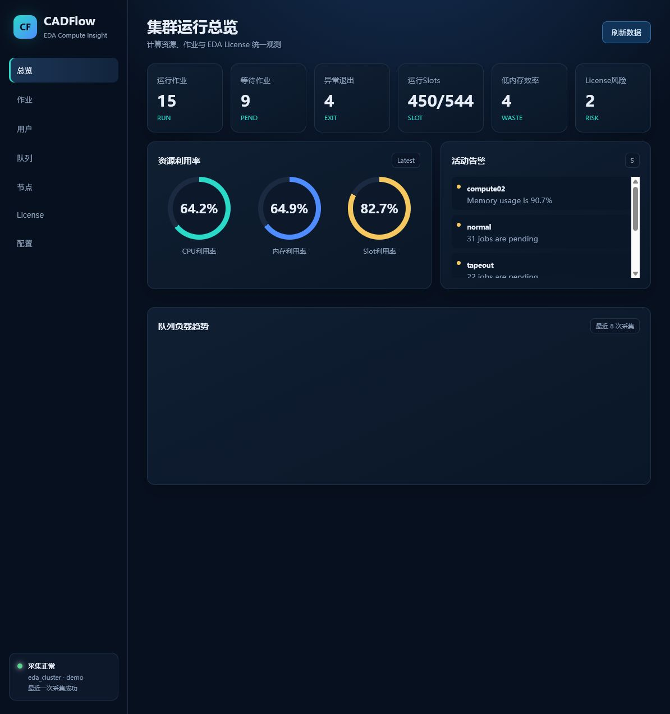
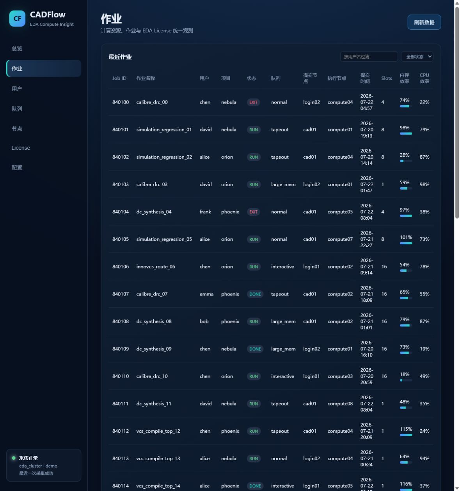
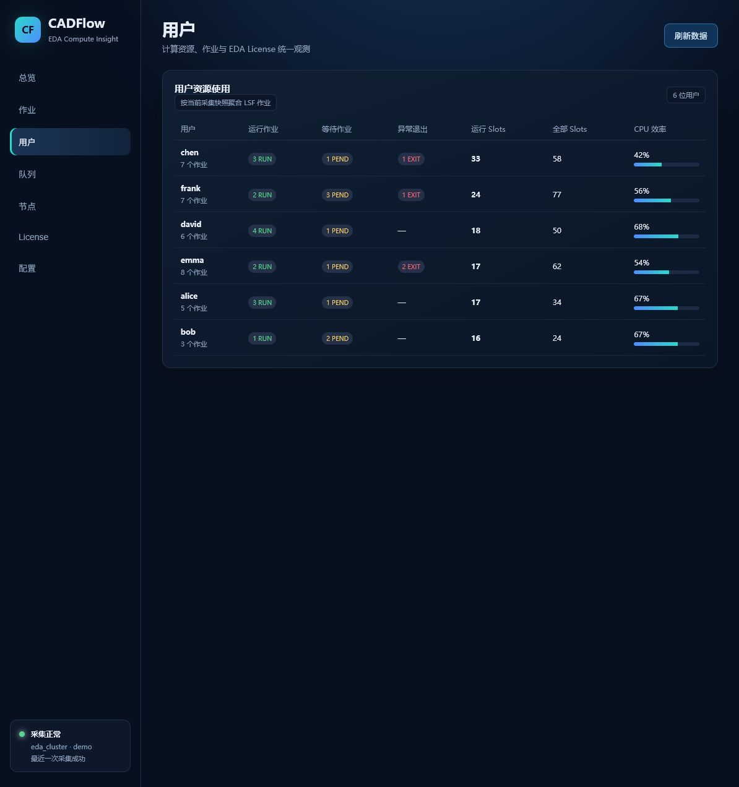
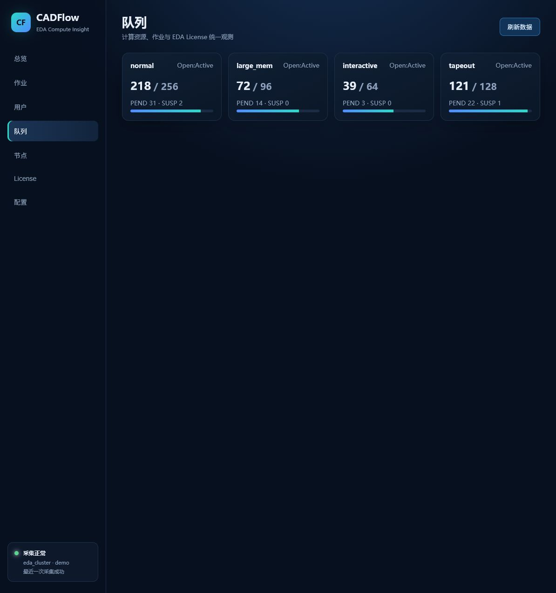
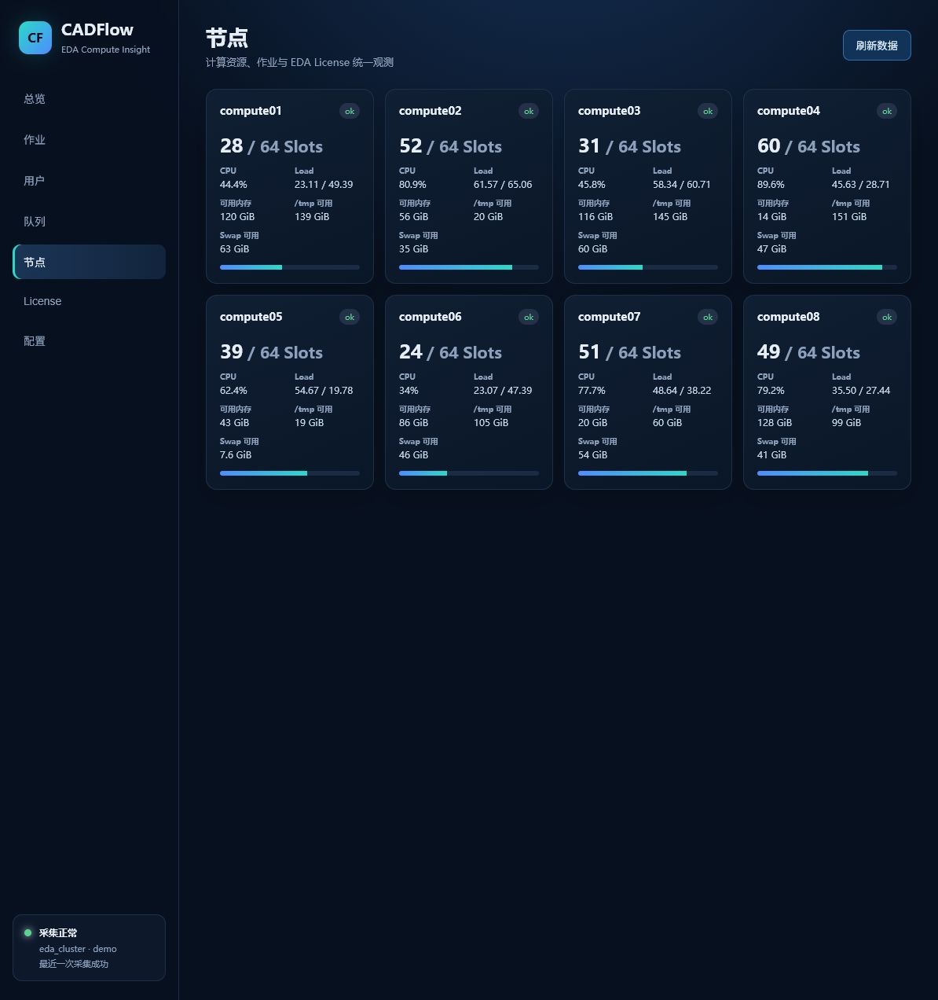
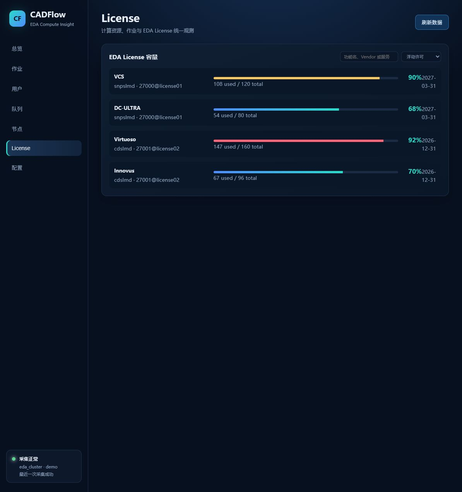
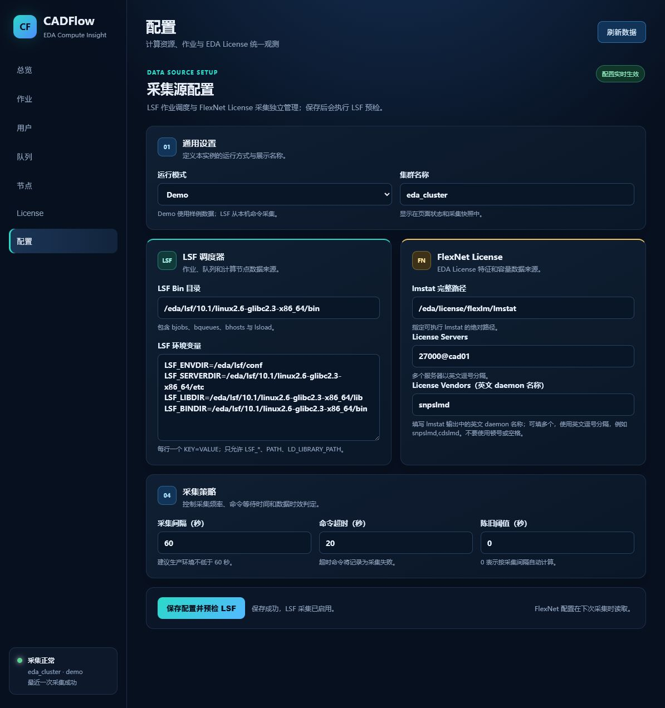

# Ncc CAD Flow

当前版本：`v0.3.21`

站点显示名称为 **Ncc CAD Flow**，项目包名仍为 `cadflow-lite`。

CADFlow Lite 是面向 EDA / CAD 运维团队的轻量级 LSF 与 FlexNet 可观测门户。它将作业、用户、队列、计算节点和 License 用量汇聚到一个 Web 界面，支持 Python 3.9+；既可在支持 Bash、Python 和可选 systemd 的 Linux 主机上部署，也可由普通账户在 LSF 登录节点手动运行。

不依赖 Docker、Podman、Docker Compose 或 Maven/POM；服务启动后直接访问 `http://服务器IP:8080`。

v0.3.21 将 LSF 的 `PSUSP`（等待期间被挂起）纳入等待作业统计和 PEND 筛选，保留表格中的真实 PSUSP 状态，避免队列 PEND 数与作业列表不一致。v0.3.20 修复旧版 LSF `lsload -w` 在 `it` 与 `tmp` 列溢出后连成一个字段的问题，恢复 `/tmp`、Swap 和可用内存的正确列对应。v0.3.19 移除作业接口的 1000 条应用层硬限制：默认返回当前 LSF 快照中的实际作业数，页面仍按每页 25 条分页以保持浏览性能；调用方可通过 `limit` 主动缩小响应。v0.3.18 增加 SQLite 数据保留策略，可按保留天数和最大数据库大小自动清理最旧快照；两项限制可分别关闭，清理只删除快照及级联明细。v0.3.17 更新脚本会显示源代码版本、提交短 SHA 和启动后的 API 版本，并减少成功时的依赖安装噪声；`/api/health` 返回运行版本。v0.3.16 在总览“等待作业”卡片增加悬停/键盘聚焦预览，直接展示已采集的真实 PEND 作业；点击卡片可跳转到作业明细。v0.3.15 修正旧版 LSF 补采等待作业使用 `bjobs -p0` 的兼容性问题，统一使用现场可用的 `bjobs -p -u all`。

## 功能概览

| 模块 | 解决的问题 |
| --- | --- |
| 总览 | 快速查看核心采集链路 SLA、运行/等待/异常作业、Slots、资源利用率与告警 |
| 作业 | 按用户、状态筛选作业；查看提交时间、缩略作业名、提交/执行节点、资源申请与运行时长 |
| 用户 | 汇总各用户的作业数、运行 Slots 与资源占用，并可搜索过滤 |
| 队列 | 查看 LSF 队列的状态、优先级、运行/等待情况；`MAX=-` 会显示为“不限”，不会误显示为 0 |
| 节点 | 查看 Slots、CPU 利用率、Load、可用内存、`/tmp` 与 Swap 等 LSF 主机资源 |
| License | 读取 FlexNet `lmstat`，按 Vendor、特征名和状态筛选许可证使用情况 |
| 配置 | 在 Web 中分别配置 LSF 与 FlexNet 采集源，并通过只读 LSF 预检后启用真实采集 |
| 主题 | 默认亮色显示，支持一键切换深色模式，并记住浏览器的选择 |
| 版本信息 | 左侧栏底部显示当前 CADFlow Lite 发布版本，便于确认部署版本 |
| 品牌导航 | 左侧品牌标识、浏览器标签页使用 CADFlow 数据流 SVG 图标，各功能导航配有离线内置图标 |
| 安装升级 | Linux 一键安装、可选 systemd 开机自启、普通账户一键升级；配置页面可发起受保护的代码更新并重启 |
| 数据清理 | 按保留天数和 SQLite 文件最大大小自动清理旧快照，默认 7 天 / 1024 MB |

`v0.3.13` 为作业、用户、队列和节点表头增加可点击排序入口，点击列名会复用对应的排序规则；原有筛选与排序控件保持不变。`v0.3.12` 队列“等待作业”卡片支持点击或键盘回车，自动跳转到作业页并筛选 `PEND`，查看真实等待作业明细。`v0.3.11` 将节点总览中的“高负载节点”替换为“平均内存”，按最近一次采集到的节点内存利用率（`mem_pct`）计算；没有可用内存字段时显示“—”，不再用负载指标代替内存。`v0.3.10` 采集并展示队列 `JL/U` 单用户并发 Slot 上限，支持按单用户上限排序；旧数据库会自动补充队列限制字段。`v0.3.9` 移除无法从现场 LSF 可靠取得的作业内存/CPU效率展示、筛选和排序，避免把未知值显示为 0%；用户页不再汇总 CPU 效率，概览仅保留可由节点和队列采集确认的指标。`v0.3.8` 修复部分 LSF `lsload -w` 输出缺少尾部字段时整行被丢弃的问题：优先用显式分隔字段采集 `r1m/r15m/ut/tmp/swp/mem`，旧版客户端自动回退到宽表解析并保留主机记录。`v0.3.7` 将总览资源卡统一按利用率表达：内存显示已用率，并同时标注已用、总量和可用量。`v0.3.6` 为作业和用户列表增加每页 25 条的分页，筛选与排序后仍按当前结果分页。`v0.3.5` 将浏览器标签页、左侧品牌导航和 API 标题统一为 `Ncc CAD Flow`。`v0.3.4` 增强了 LSF 作业采集：当完整作业快照没有 PEND 记录时，显式补采 `bjobs -p0 -u all`，兼容部分旧版 LSF 未在 `bjobs -a -o` 输出中返回 PEND 作业的情况，并按 Job ID 去重。

## 产品界面

以下图片来自当前 CADFlow Web 界面。截图中的数据为演示数据，仅用于展示布局与交互；生产数据由现场 LSF 与 FlexNet 命令只读采集。

### 1. 集群总览

一屏汇总作业状态、Slots、资源利用率、活跃告警及队列负载趋势，适合日常值守。



### 2. 作业

支持按用户和作业状态过滤；每个作业显示提交时间、缩略作业名称、提交节点、执行节点、申请资源与运行时长。



### 3. 用户

按 LSF 用户汇总运行、等待、异常作业与 Slots 使用，便于定位资源占用来源。



### 4. 队列

展示队列优先级、开放/激活状态、作业数、等待数和运行数，辅助判断调度瓶颈。



### 5. 节点

展示节点可用 Slots、CPU、Load、可用内存、`/tmp` 与 Swap；数据直接对应 LSF 的 `bhosts` 与 `lsload` 输出。



### 6. License

汇总 FlexNet 特征许可的总数、已用数、剩余数和风险状态，提供关键字、Vendor 与状态筛选。



### 7. 采集源配置

LSF 与 FlexNet 独立配置：LSF 使用固定白名单命令采集；FlexNet 指定 `lmstat`、License Server 与一个或多个 Vendor。保存时会执行 LSF 只读预检。



## 数据采集方式

```text
LSF 命令 (bjobs / bqueues / bhosts / lsload) ─┐
                                               ├─> CADFlow 采集器 ─> SQLite ─> Web / API / Prometheus
FlexNet 命令 (lmstat -a) ──────────────────────┘
```

- 采集命令固定为只读白名单：`bjobs`、`bqueues`、`bhosts`、`lsload`、`lmstat`。
- LSF 和 FlexNet 失败彼此隔离：License 暂不可用时，LSF 的作业、队列和节点数据仍可继续采集。
- LSF 作业名称按固定字段解析，即使命令行名称包含 `|` 管道符，也不会破坏作业表格。
- LSF `lsload` 提供的是节点可用内存而非总内存；总览在无法计算利用率时显示可用内存合计，避免展示虚假的百分比。
- 采集结果保存在 SQLite（WAL 模式）；`/metrics` 可供 Prometheus 抓取。
- 首页 SLA 使用近 24 小时采集快照计算 LSF 作业、队列、节点、FlexNet License 与整体采集链路的可用性，同时公开样本覆盖率；它不替代独立的网络/端口存活探针。

## Linux 一键安装（可选 systemd）

`install-linux.sh` 适用于带有 Bash、Python 3、systemd、curl、tar 和常用 POSIX 工具的 Linux 主机。脚本不调用 `dnf`、`yum` 或其他发行版专属包管理器；依赖需要预先由管理员提供，或通过 `--source` 使用已准备好的离线源码。没有 systemd、不能使用 root，或需要保持系统环境不变时，请使用下面的普通账户部署方式。

```bash
git clone https://gitee.com/raychade/cadflow-lite.git
cd cadflow-lite
sudo bash deploy/install-linux.sh
```

安装完成后，打开：

```text
http://SERVER_IP:8080
```

默认以 Demo 模式启动，便于立即验证页面。真实 LSF 环境请在左侧 **配置** 页面填写 LSF 和 FlexNet 参数后保存。

常用目录：

```text
<app-root>/current                         当前运行版本（软链接）
<app-root>/releases/<timestamp>            各版本发布目录
<config-dir>/cadflow.env                   持久化服务配置
<data-dir>/cadflow.db                      SQLite 数据和 Web 配置
```

如果不希望安装脚本调整防火墙：

```bash
sudo bash deploy/install-linux.sh --no-firewall
```

## 离线普通账户部署（不使用 systemd）

适用于不能访问外网、不能修改系统配置、且只允许普通账户运行的 LSF 登录节点。安装脚本会自动选择可用的 Python 3.12、3.11、3.10 或 3.9；解释器应提供标准库 `sqlite3` 模块。如果现场 Python 缺少该扩展，可通过离线 `pysqlite3-binary` wheel 回退。也可以用 `--python` 明确指定现场的解释器。

### 一键部署

如果 Python 3.12 环境已经安装 FastAPI/Uvicorn 且 `sqlite3` 可导入，直接在项目目录执行：

```bash
bash deploy/install-user.sh --python python3.12
```

脚本会检测该 Python 是否已有 FastAPI/Uvicorn：如果已有，就创建使用系统包的 `.venv`，不下载、不安装；如果没有，或 Python 缺少 `sqlite3`，则从 `wheelhouse/` 离线安装（缺少 SQLite 时自动加入 `pysqlite3-binary`）。随后生成通用 `.cadflow.env`、启动 8080 并验证健康检查。它不会写入 LSF/FlexNet 路径；首次打开页面后，在“配置”菜单填写现场路径并保存即可。如果 `python3.12` 已在 PATH 中，上面就是 RHEL 8.10 的完整一键部署命令。也可以指定任意项目目录、Python 和端口：

首次部署会生成一次“配置管理口令”，脚本只在终端显示一次；配置口令以 PBKDF2 哈希保存到 `.cadflow.env`。普通用户仍可查看总览、作业、节点和 License，但打开“配置”菜单或调用配置 API 必须先验证口令。验证会话通过 HttpOnly 签名 Cookie 默认保持 7 天，页面刷新、服务重启或多进程运行不会要求重复输入；退出配置会话后浏览器 Cookie 立即删除，口令哈希变更后旧会话自动失效。可通过 `CADFLOW_CONFIG_SESSION_TTL_SECONDS` 缩短时长。

```bash
bash deploy/install-user.sh \
  --app-dir /path/to/cadflow \
  --wheelhouse /path/to/wheelhouse \
  --python python3 \
  --port 8080
```

### 1. 在可联网机器准备 Linux 依赖

不要在 Windows 上直接安装 Windows wheel。下载目标平台为 Linux x86_64、Python 3.12 的 Linux wheel：

```powershell
py -3.12 -m pip download `
  --dest C:\Temp\cadflow-offline\wheelhouse `
  --only-binary=:all: `
  --platform manylinux_2_17_x86_64 `
  --implementation cp `
  --python-version 3.12 `
  "fastapi>=0.115,<1" `
  "uvicorn>=0.30,<1" `
  "pysqlite3-binary>=0.5,<1"
```

将 `wheelhouse` 目录复制到服务器项目目录下。如果目标 Python 已有标准库 `sqlite3`，脚本不会使用 `pysqlite3-binary`；否则会自动使用它作为 SQLite 回退。不需要 `uvicorn[standard]` 的可选本地扩展。

### 2. 在服务器创建虚拟环境并离线安装

```tcsh
cd <项目目录>
python3.12 --version
python3.12 -m venv .venv
.venv/bin/python -m pip install --no-index --find-links=wheelhouse \
  "fastapi>=0.115,<1" "uvicorn>=0.30,<1"
```

### 3. 以普通账户手动启动

首次启动不需要填写任何现场 LSF/FlexNet 路径。应用先以 Demo 模式启动，随后在 Web 的“配置”页面填写集群名、LSF Bin、LSF 环境变量、`lmstat`、License Server 和 Vendor；这些值会保存到 SQLite，不写入源码或启动脚本。

“配置”页面的“数据保留与清理”用于控制 SQLite 快照增长：`保留天数`按采集时间删除旧快照，`最大数据库大小（MB）`在文件（含 SQLite WAL/SHM）超过上限时删除最旧快照。两项策略同时生效，`0` 表示关闭对应限制；默认分别为 7 天和 1024 MB。每次成功采集后执行，始终保留当前最新快照，清理不会修改 LSF/FlexNet 配置或系统文件。若希望完全停用自动清理，可将两项都设为 0，但生产环境不建议这样设置。

```tcsh
setenv CADFLOW_MODE demo
setenv CADFLOW_CLUSTER_NAME demo-cluster
setenv CADFLOW_DB_PATH ./data/cadflow.db
setenv CADFLOW_BIND_HOST 0.0.0.0
setenv CADFLOW_PORT 8080
setenv CADFLOW_ADMIN_TOKEN `./.venv/bin/python -c 'import secrets; print(secrets.token_hex(32))'`

mkdir -p data logs
nohup .venv/bin/python -m uvicorn app.main:app --host "$CADFLOW_BIND_HOST" --port "$CADFLOW_PORT" >& logs/cadflow.log &
echo $! > cadflow.pid
```

验证与停止：

```tcsh
sleep 3
curl -s http://127.0.0.1:8080/api/health
tail -n 80 logs/cadflow.log
kill `cat cadflow.pid`
```

该方式只在当前用户目录创建 `.venv`、SQLite 数据和日志，不创建 systemd 服务，不修改防火墙、LSF 配置或系统 Python。

### 4. 普通账户一键更新

`deploy/update-user.sh` 不使用 `sudo` 或 `systemctl`。它从当前 Git 远程执行快进更新，先编译检查，再备份 SQLite、重启 `cadflow.pid` 记录的进程，并在健康检查失败时回滚到旧提交。更新不会重新联网安装依赖；如果依赖发生变化，先把离线 wheel 放入 `wheelhouse/` 并手动更新 `.venv`。为避免更新后误启动成 Demo 模式，脚本要求当前 shell 已设置 `CADFLOW_MODE`，或项目中存在 `.cadflow.env`。

更新前请保持 Git 工作区干净；`.cadflow.env`、`data/`、`logs/`、`backups/` 和 `wheelhouse/` 等运行时目录已加入忽略列表，不会阻止更新。

建议把启动时的通用变量保存到项目目录下的 `.cadflow.env`（该文件已被 `.gitignore` 忽略），这样重新登录后也能一键更新。LSF/FlexNet 路径不要放在这个文件中，统一从 Web“配置”页面维护：

```bash
cd <项目目录>
cat > .cadflow.env <<'EOF'
CADFLOW_MODE=demo
CADFLOW_CLUSTER_NAME=demo-cluster
CADFLOW_DB_PATH=./data/cadflow.db
CADFLOW_BIND_HOST=0.0.0.0
CADFLOW_PORT=8080
CADFLOW_ADMIN_TOKEN=替换为已有管理令牌
CADFLOW_DB_RETENTION_DAYS=7
CADFLOW_DB_MAX_SIZE_MB=1024
EOF
chmod 600 .cadflow.env
```

执行更新：

```bash
cd <项目目录>
bash deploy/update-user.sh
```

如果希望把拉取代码、口令迁移和后台重启合并为一条命令，直接执行：

```bash
bash deploy/update-and-start.sh
```

该入口使用当前 Git 上游（服务器部署时应指向内网 GitLab），执行 `git pull --ff-only` 后调用一键部署脚本并强制重启；不使用 `sudo` 或 `systemctl`。

更新锁只保护安装/重启过程，后台 CADFlow 服务不会持有该锁；如果看到“another CADFlow install/start operation is running”，先确认是否已有安装脚本正在执行，勿直接删除锁文件。

安装脚本会自动兼容旧版本生成的 `CADFLOW_CONFIG_PASSWORD_HASH`，并将其中的 `$` 分隔符安全写入配置，避免 Bash `set -u` 把 PBKDF2 的迭代次数误解为位置参数。

脚本会保留 `.venv`、`data/`、`logs/` 和 `backups/`，并输出新的提交号、PID、健康检查地址和日志路径。也可以指定分支：

```bash
bash deploy/update-user.sh --ref master
```

## 配置真实 LSF / FlexNet

在 **配置** 页面填写：

1. 运行模式选择 **LSF**，并填写现场集群名称。
2. 填写现场 LSF Bin 目录；不要修改源码，直接在此页面保存。
3. 在 LSF 环境变量中填写 `LSF_ENVDIR`、`LSF_SERVERDIR`、`LSF_LIBDIR`、`LSF_BINDIR` 等现场变量。
4. 填写现场 `lmstat` 的完整路径和 License Server，例如 `27000@license-host`。
5. License Vendor 可填写多个名称，使用英文逗号分隔，例如：`vendor_a,vendor_b`。
6. 点击 **保存配置并预检 LSF**。预检通过后，后续采集即使用现场真实命令。

如需在服务器上验证现场命令，请将下面的占位路径替换为实际路径：

```bash
sudo -u <运行账户> bash -lc '
  source <LSF 环境脚本>
  bjobs -u all -a
  bqueues -w
  bhosts -w
  lsload -w
  <lmstat 完整路径> -a -c <端口@许可证服务器>
'
```

## systemd 模式的运行、日志与升级

从本次版本开始，新安装会自动提供 `cadflow-update`。旧版本升级时，可直接运行旧安装目录中已有的升级入口；新版本统一使用 `upgrade-linux.sh`。

```bash
sudo cadflow-update
```

这次升级成功后，后续统一使用短命令：

```bash
# 服务状态与日志
sudo systemctl status cadflow-lite --no-pager
sudo journalctl -u cadflow-lite -f

# 重启服务
sudo systemctl restart cadflow-lite

# 从 Gitee master 一键升级，失败自动回滚
sudo cadflow-update
```

服务由 systemd 管理，并在安装时启用开机自启；服务器重启后 CADFlow 会自动恢复。

升级过程会自动拉取代码、创建独立版本目录、停止服务、备份 SQLite、原子切换版本并检查 `/api/health`。20 秒内未恢复健康会自动切回上一版本。

升级到指定分支或标签：

```bash
sudo cadflow-update --ref v0.2.0
```

使用已下载的本地源码升级：

```bash
sudo cadflow-update --source /path/to/cadflow-lite
```

## API

| API | 用途 |
| --- | --- |
| `GET /api/health` | 运行版本、采集健康、部分失败信息、陈旧状态和快照年龄 |
| `GET /api/summary` | 集群总览 |
| `GET /api/sla` | 近 24 小时核心采集功能的可用性、覆盖率与状态时间线 |
| `GET /api/jobs` | 作业列表，支持状态/用户/队列过滤；默认返回当前快照的实际作业数，可用 `limit=1..实际总数` 主动缩小响应 |
| `GET /api/queues`、`/api/hosts`、`/api/licenses` | 队列、节点、License 数据 |
| `POST /api/config/auth`、`POST /api/config/logout` | 配置管理口令登录与退出 |
| `POST /api/update` | 需要配置会话；启动当前 Git 上游的快进更新脚本并重启服务 |
| `GET /api/config`、`PUT /api/config` | 需要配置管理会话的 Web 配置 |
| `POST /api/collect` | 立即触发一次采集 |
| `GET /metrics` | Prometheus 指标 |

## 开发验证

代码交付与 README/Demo 图维护规则见 [CONTRIBUTING.md](CONTRIBUTING.md)。

```bash
python3 -m pytest -q
```
